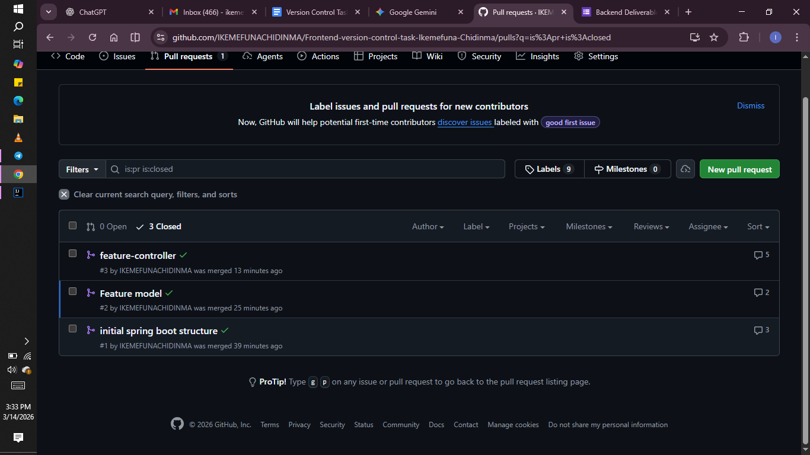
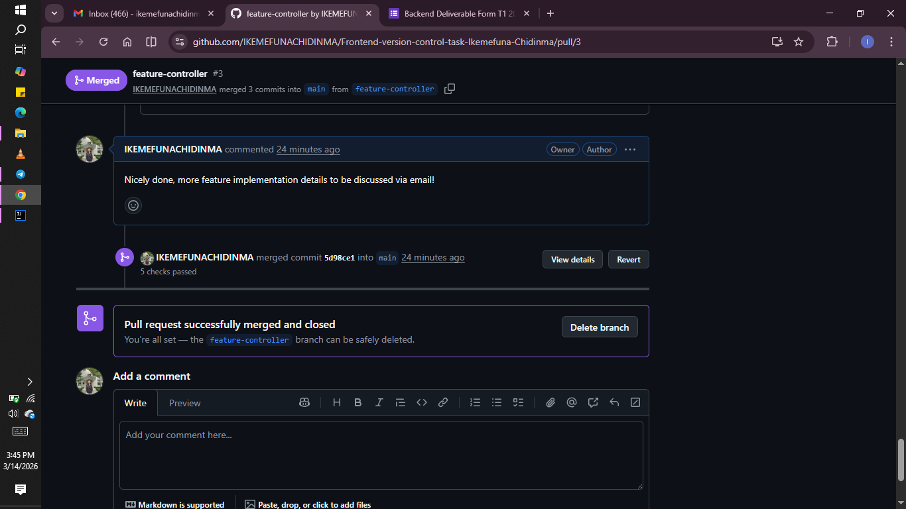
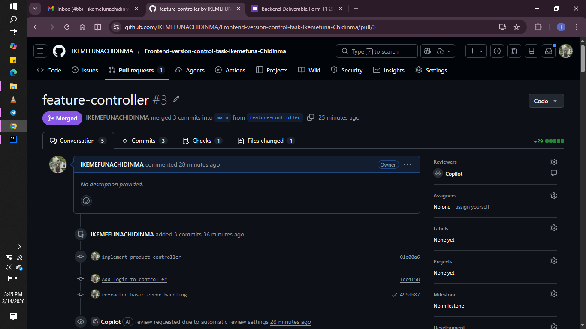
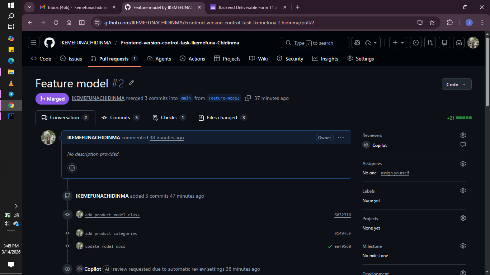

# Frontend-version-control-task-Ikemefuna-Chidinma
A Spring Boot REST API for a Bakery Product Catalog to demonstrate Git workflow proficiency.

## Models
- Product: Represents bakery items with ID, Name, Price, and Category.
- Category: Enum defining CAKE, BREAD, PASTRY, and COOKIE.

## Branching Strategy
* `feature-model`: Defines the Product data structure.
* `feature-bakery-controller`: (Renamed from feature-controller) Handles HTTP requests.

## Frequent Commands Used
* `git checkout -b [name of branch]`
* `git commit -m "...commit information..."`
* `git revert [hash from log]`
* `git merge`

##Screenshots

## Lessons Learned
1. Always pull from `main` before starting a new branch to avoid conflicts.
2. Meaningful commit messages make debugging much faster for you and your collaborators.

